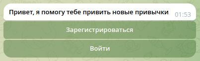

<div style="text-align: center;">

<h1 style="text-align: center">Telegram-bot для backend сервиса привития привычек.</h1>
</div>

###  Описание приложения.
Проект представляет собой сервис для привития полезных привычек.
Сервис позволяет пользователям ставить себе цели и задачи,
отслеживать прогресс и получать напоминания о необходимости выполнения действий.

Приложение для формирования полезных привычек через мессенджер Telegram.
Позволяет создавать и отслеживать прогресс по выполнению задач.

Telegram-bot включает в себя следующие функции:
1. Регистрация;
2. Авторизация и аутентификация;
3. Создание, редактирование и удаление привычки.

[Ссылка на backend](https://github.com/Raket-o/habits_fastapi)

---

###  Запуск.
Запуск через Docker-compose:
Открываем терминал, переходим в корневую папку с проектом:

1. Создаём образ командой ```docker-compose -p app_aiogram_to_fastapi build```
2. Поднимаем контейнер ```docker-compose -p app_aiogram_to_fastapi up```

---

## Инструкция по работе telegram-bot.

### Экран приветствия:


* Зарегистрироваться - регистрация нового пользователя. Бот запрашивает имя и пароль, если пользователь успешно зарегистрирован, выводит сообщение "Вы зарегистрированы"
* Войти - авторизация. Бот запрашивает имя и пароль, далее выводит экран со списком привычек

### Главный экран:


На экран выводится список с записанными привычками
* Записать привычку - создать новую привычку. Бот запрашивает название привычки, описание и время оповещения, если привычка создана успешно, выводит сообщение "Привычка добавлена"
* Выйти - прекращение сеанса работы в качестве зарегистрированного пользователя

### Экран деталей привычки:


* Редактировать - возможность изменение названия, комментария или время оповещения, если привычка отредактирована успешно, выводит сообщение "Изменил"
* Удалить - удаляет привычку
* Вернуться к списку - возвращает на "Главный экран"

---

<h2>Лицензия</h2>
Проект распространяется под лицензией MIT.